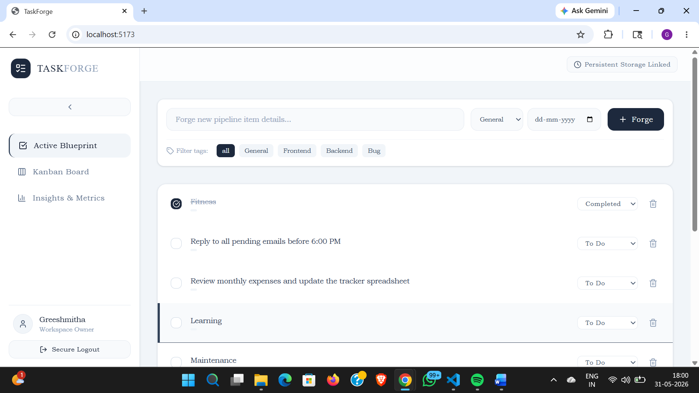
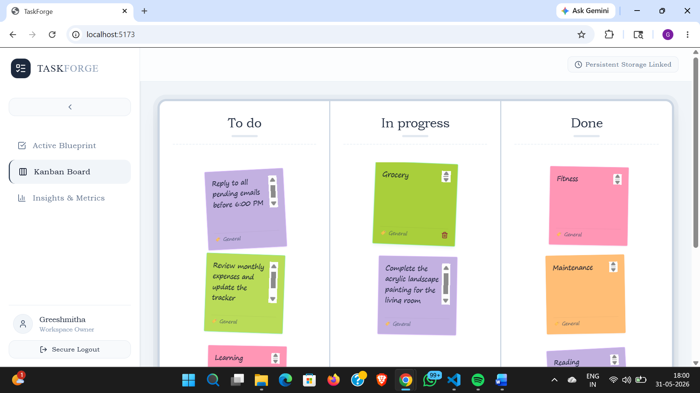
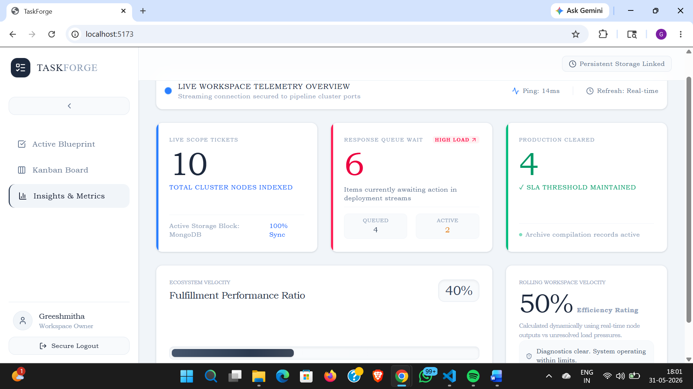

# TaskForge 🚀

TaskForge is a clean, full-stack project management app built on the MERN stack. I designed it to be a minimal but powerful workspace for software developers, keeping the focus entirely on what matters: tracking tasks, visualizing workflows, and seeing your actual productivity metrics without any unnecessary fluff.

---

## ✨ What it Does

### 🛠️ Clean, Focus-First Interface
* **Collapsible Sidebar:** You can expand the menu to navigate or collapse it down into a tiny icon bar when you want full-screen real estate for your code workflows or boards.
* **Smart Input Forms:** The "Forge Task" input bar only shows up on the task management pages where you actually need it, keeping the analytics tab purely dedicated to clean data visualization.

### 📊 Real-Time Analytics & Metrics
* **Smart Backlog Monitor:** The dashboard calculates your queue load in real-time. If things pile up, it triggers a red `HIGH LOAD ↗` alert so you know you're bottlenecked; otherwise, it keeps you at a green `STABLE ↘`.
* **Rolling Velocity Score:** Instead of just showing raw numbers, the app dynamically calculates an efficiency rating based on your active backlog versus your completed items.
* **Fluid Progress Bars:** Includes a custom progress bar with a built-in shimmer wave animation to visualize your project milestone fulfillment.

### 🗺️ Physical Kanban Board
* **Tactile Board Feel:** Using custom CSS keyframes, the board feels incredibly responsive—sticky notes slightly wiggle when you hover over them to give it a physical feel.
* **Clean Typographical Mix:** Blends crisp modern typography for UI elements with a lightweight handwriting script font style directly on the colored sticky notes.
* **Seamless Drag-and-Drop:** Built with native HTML5 drag-and-drop actions that immediately update your MongoDB collection on release.

### 🏷️ Better Task Data
* **Developer Project Tags:** Categorize your cards by area using specialized tags like `Frontend`, `Backend`, `Bug`, or `General`.
* **Milestone Due Dates:** Attach deadlines directly to your blueprints so you can catch overdue items before they slide.

---

## 💻 Tech Stack

* **Frontend:** React, Tailwind CSS, Lucide React (Icons)
* **Backend:** Node.js, Express.js
* **Database:** MongoDB via Mongoose
* **Authentication:** JSON Web Tokens (JWT)

---

## 🚀 Getting Started

### Prerequisites
Make sure you have Node.js installed locally, along with a running instance of MongoDB (either local or a MongoDB Atlas URI string).

### Setup
1. Clone the project to your machine.
2. Spin up your backend environment by creating an `.env` file in the `/server` folder containing your custom PORT string, JWT secret, and database URI connection string.

### Run the App

#### 1. Start the Backend Server
```bash
cd server
npm install
npm start

#### 1. Start the Backend Server
cd client
npm install
npm run dev

### 📋 Active Blueprint


### 🗺️ Physical Kanban Board


### 📊 Insights & Metrics
